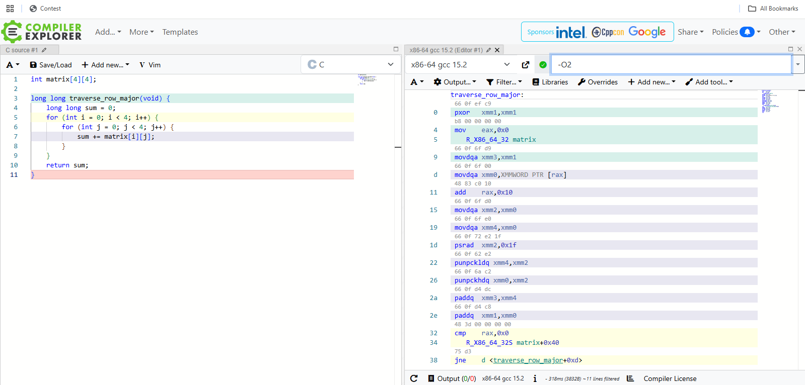
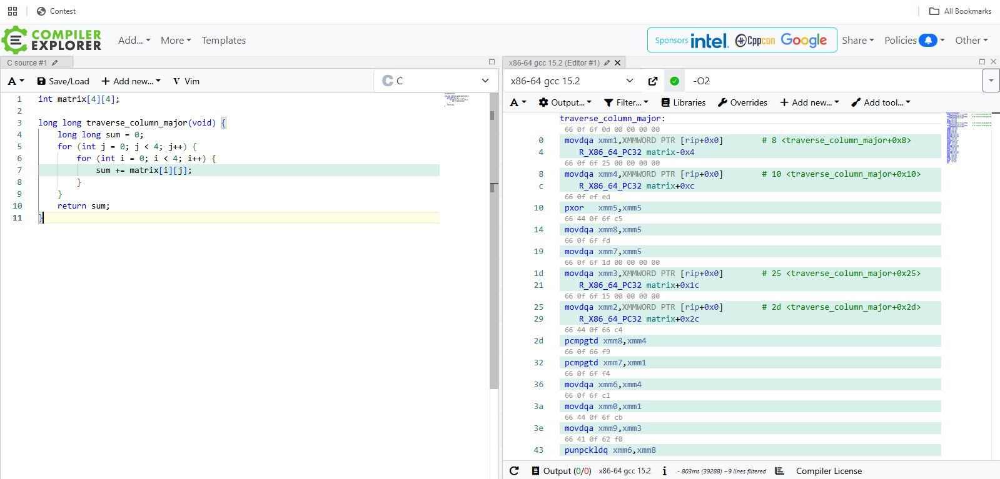

# Cache Behavior Lab Analysis

## Section 1: Performance Measurements

Matrix Size: 1024 x 1024

| Traversal Method | Time (seconds) |
|---|---:|
| Row-major | 0.002000 |
| Column-major | 0.006000 |

**Ratio:** Column-major / Row-major = **3.0x**

The column-major traversal was approximately three times slower than the row-major traversal, even though both functions performed the same computation and visited the same number of elements.

---

## Section 2: Optimization Level Comparison

| Optimization Level | Row-major Time | Column-major Time |
|---|---:|---:|
| -O0 | 0.002000 | 0.006000 |
| -O2 | 0.000000 | 0.000000 |
| -O3 | 0.000000 | 0.000000 |

At **-O0**, the performance gap is clearly visible, with column-major traversal taking about three times longer than row-major traversal.

At **-O2** and **-O3**, both times displayed as `0.000000` seconds because the execution became too fast for the timing resolution used in this program, and compiler optimizations likely reduced the measurable overhead.

Even so, **-O3 does not fundamentally eliminate the cache effect**, because compiler optimization cannot change the underlying memory layout or fully fix an inefficient access pattern.

---

## Section 3: Assembly Analysis

The generated assembly for the row-major and column-major functions is similar in overall structure. Both functions use nested loops, load values from memory, and accumulate them into a running sum.

This shows that the large performance difference does not come from radically different machine instructions, but from how each function interacts with the CPU cache at runtime.

### Row-major Assembly Screenshot

### Column-major Assembly Screenshot

---

## Section 4: Cache Behavior Explanation

C stores two-dimensional arrays in **row-major order**. This means the elements of the first row are stored next to each other in memory, followed immediately by the elements of the second row, and so on.

Because of this layout, accessing a matrix row by row matches the physical organization of memory. In the row-major version of this lab, the program visits `matrix[i][j]` with `j` changing fastest, so each new access usually refers to the next memory location. This gives the CPU strong **spatial locality**.

When the CPU reads memory, it does not usually fetch a single integer by itself. Instead, it loads an entire **cache line**, often **64 bytes at a time**. During row-major traversal, bringing one cache line into the cache also brings in several nearby matrix elements that will be used immediately by the next loop iterations.

As a result, the processor gets **high cache efficiency** and relatively few cache misses. That is why the row-major version finishes faster even though it performs the same arithmetic work.

In the column-major version, the code accesses `matrix[i][j]` with `i` changing fastest. Since C arrays are stored row by row, this means each access jumps far away in memory rather than moving to the next adjacent element.

The CPU still loads a full cache line each time, but much of that line is wasted because the nearby values are not used right away. This produces many more **cache misses** and forces the processor to wait on slower memory more often.

The performance penalty comes from **memory behavior, not algorithmic complexity**.

The compiler cannot fully fix this problem through optimization because the problem is rooted in **data layout and access order**. Although the compiler can improve loop overhead and register usage, it cannot rearrange the matrix in memory or safely change the intended traversal pattern without altering the meaning of the code.

That is why row-major access remains more efficient on real hardware.

### Final Project Connection

This concept applies directly to my final project because performance depends not only on choosing the right algorithm, but also on accessing data in a **cache-friendly way**.

I will try to use **contiguous data structures** whenever possible and process data sequentially instead of jumping around memory.

Understanding cache behavior will help me make better implementation decisions that improve real-world speed.